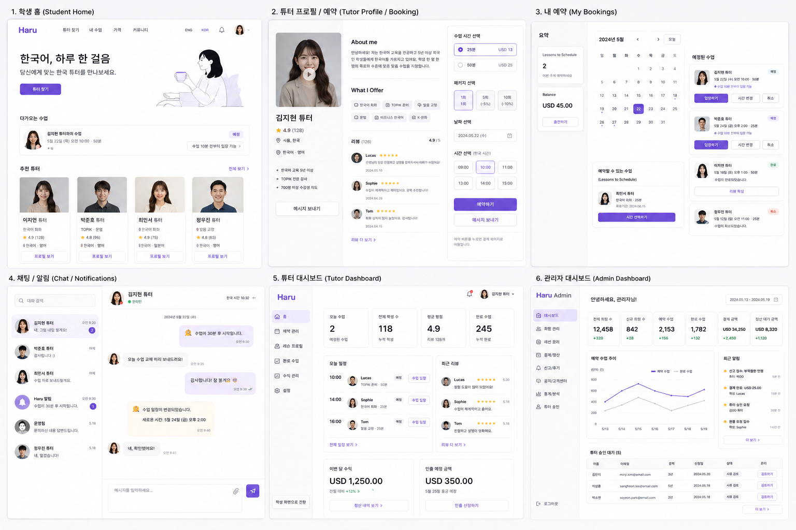
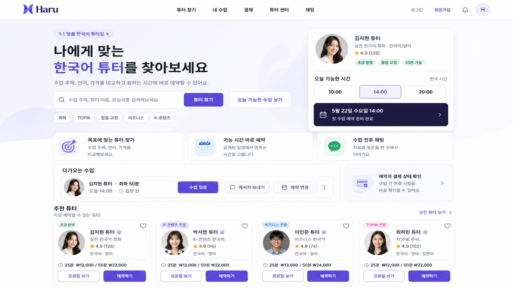

<div align="center">


# Haru

한국어 튜터 탐색, 예약, 결제, 수업 운영까지 하나의 흐름으로 연결하는 풀스택 서비스입니다.

`Spring Boot 3.5` · `Java 21` · `MySQL 8` · `Flyway` · `Next.js 15` · `React 19` · `Docker Compose`

<br>


</div>

---

## Overview

Haru는 하나의 계정으로 학생과 튜터 역할을 전환하며 사용할 수 있는 한국어 튜터링 플랫폼입니다.
학생은 공개 튜터 목록에서 프로필과 가능 시간대를 확인하고 예약과 결제를 진행할 수 있고, 튜터는 프로필 심사와 일정 관리, 예약 운영을 수행할 수 있습니다.
관리자는 승인 대기 중인 튜터 프로필을 검수하고 서비스 상태를 관리합니다.

현재 저장소에는 다음 영역이 함께 포함되어 있습니다.

| Area | Description |
| --- | --- |
| Backend API | 인증, 사용자, 튜터, 일정, 예약, 결제, 관리자 API |
| Frontend | Next.js 기반 학생/튜터/관리자 화면 |
| Test Console | 브라우저에서 API 시나리오를 실행하는 테스트 UI |
| API Docs | Swagger UI 및 OpenAPI JSON |
| Database | Flyway 기반 MySQL 스키마와 local seed |
| Docker | backend + mysql 통합 실행 환경 |

## Product Snapshot

### Service Screens



### Home Concept



### API Test Console


### Swagger UI


## Current Scope

| Category | Status |
| --- | --- |
| Auth | 회원가입, 로그인, 로그아웃, refresh token 회전 및 재사용 차단 |
| User | 프로필 조회/수정, 마지막 로그인 시각 기록, active role 변경 |
| Tutor | 튜터 전환, 프로필 저장, 이미지 업로드, 승인 요청, 공개 프로필 조회 |
| Schedule | 튜터 가능 시간 슬롯 저장/조회, 공개 일정 조회 |
| Booking | 수업 예약 생성, 내 예약 조회, 취소, 입장 가능 여부 확인 |
| Payment | 결제 생성, 결제 내역 조회, 환불 요청, Lemon Squeezy 연동 준비 |
| Admin | 승인 대기 튜터 목록, 승인/반려 처리 |
| Frontend | 학생 홈, 튜터 상세, 내 예약, 튜터 대시보드, 관리자 화면 |
| Docs | Swagger, API 계획, DB 문서, README, 구현 현황 문서 |

## Architecture

### Backend

Spring Boot 애플리케이션은 다음 도메인 중심 패키지로 구성되어 있습니다.

```text
src/main/java/com/haru
├── auth
├── booking
├── common
├── payment
├── schedule
├── tutor
└── user
```

### Frontend

Next.js 앱은 App Router 기반으로 학생, 튜터, 관리자 화면을 분리합니다.

```text
frontend/src/app
├── account
├── admin
├── bookings
├── chat
├── payments
├── tutor
└── tutors
```

## Quick Start

### 1. Backend with Docker

백엔드와 MySQL을 먼저 실행합니다.

```powershell
docker compose up --build -d
```

실행 후 확인 가능한 주소는 다음과 같습니다.

| Service | URL |
| --- | --- |
| Backend API | http://localhost:8080 |
| API Test Console | http://localhost:8080/test-ui.html |
| Swagger UI | http://localhost:8080/swagger-ui.html |
| OpenAPI JSON | http://localhost:8080/v3/api-docs |
| MySQL | localhost:3306 |

상태 확인과 종료 명령:

```powershell
docker compose ps
docker compose logs -f backend
docker compose down
docker compose down -v
```

### 2. Frontend Dev Server

프론트엔드는 별도 터미널에서 실행합니다.

```powershell
Set-Location frontend
npm install
npm run dev
```

기본 개발 주소:

| Service | URL |
| --- | --- |
| Frontend | http://localhost:3000 |

`.env.example`를 참고해 필요한 환경 변수를 구성할 수 있습니다.

## Accounts And Local Settings

Docker Compose에서 `local` seed를 사용하면 테스트용 관리자 계정이 생성됩니다.

| Type | Value |
| --- | --- |
| Admin Email | `admin@admin.com` |
| Admin Password | `admin1234` |
| Roles | `ADMIN`, `STUDENT` |

기본 MySQL 계정:

| Type | Value |
| --- | --- |
| Host | `localhost` |
| Port | `3306` |
| Database | `haru` |
| Username | `haru` |
| Password | `1q2w3e4r!` |

## Tech Stack

| Layer | Technology |
| --- | --- |
| Backend Language | Java 21 |
| Backend Framework | Spring Boot 3.5.7 |
| Security | Spring Security, JWT |
| Database | MySQL 8.x |
| Persistence | Spring Data JPA, Hibernate |
| Migration | Flyway |
| Frontend | Next.js 15, React 19, TypeScript |
| Styling | Tailwind CSS |
| API Docs | springdoc-openapi |
| Build | Gradle, npm |
| Runtime | Docker Compose |

## Domain Rules

하나의 사용자는 여러 역할을 가질 수 있지만, 앱에서는 하나의 `activeRole`만 선택합니다.

| Field | Meaning |
| --- | --- |
| `user_roles` | 계정에 부여된 사용 가능 역할 목록 |
| `users.active_role` | 현재 사용자가 선택한 앱 모드 |
| `tutor_profiles.status` | 튜터 심사 및 공개 노출 상태 |

핵심 규칙:

```text
activeRole = TUTOR
```

튜터 기능에 진입한 상태를 의미합니다. 공개 판매 가능 상태와는 다릅니다.

```text
tutorProfileStatus = APPROVED
```

이 상태일 때만 공개 튜터 목록과 상세 페이지에서 노출됩니다.

튜터 프로필 상태는 `DRAFT`, `PENDING`, `APPROVED`, `REJECTED`를 사용합니다.

## Database

DB 스키마는 Flyway로 관리합니다.

```text
src/main/resources/db/migration
src/main/resources/db/seed/local
```

주요 테이블:

| Table | Description |
| --- | --- |
| `users` | 사용자 계정 |
| `user_roles` | 사용자 역할 목록 |
| `refresh_tokens` | refresh token 저장 및 회전 관리 |
| `tutor_profiles` | 튜터 프로필, 가격, 승인 상태 |
| `tutor_schedule_slots` | 튜터 가능 시간 슬롯 |
| `bookings` | 학생-튜터 수업 예약 |
| `payments` | 예약 결제 및 환불 상태 |
| `flyway_schema_history` | Flyway migration 이력 |

현재 주요 마이그레이션:

| File | Description |
| --- | --- |
| `V1__auth_user_schema.sql` | 사용자, 역할, refresh token 기본 스키마 |
| `V2__add_user_last_login_at.sql` | 마지막 로그인 시각 컬럼 추가 |
| `V3__create_tutor_profiles.sql` | 튜터 프로필 및 승인 상태 추가 |
| `V4__structure_tutor_profile_pricing.sql` | 25분/50분 가격 컬럼 추가 |
| `V5__drop_legacy_tutor_lesson_price_amount.sql` | legacy 가격 컬럼 제거 |
| `V6__create_tutor_schedule_slots.sql` | 튜터 일정 슬롯 생성 |
| `V7__create_bookings.sql` | 예약 테이블 생성 |
| `V8__create_payments.sql` | 결제 테이블 생성 |
| `V9__add_lemon_squeezy_payment_fields.sql` | 외부 결제 연동 필드 추가 |
| `R__local_admin_seed.sql` | 로컬 관리자 계정 seed |

Hibernate `ddl-auto`는 `validate`로 설정되어 있어, 스키마 변경은 항상 마이그레이션으로 반영해야 합니다.

## API Summary

| Area | 주요 엔드포인트 |
| --- | --- |
| Auth | `/api/auth/signup`, `/api/auth/login`, `/api/auth/refresh`, `/api/auth/logout`, `/api/auth/me` |
| User | `/api/users/me`, `/api/users/me/active-role` |
| Tutor | `/api/tutors/me/switch`, `/api/tutors/me/profile`, `/api/tutors/me/profile/submit`, `/api/tutors`, `/api/tutors/{id}` |
| Schedule | `/api/tutors/me/schedule`, `/api/tutors/{id}/schedule` |
| Booking | `/api/bookings`, `/api/bookings/me`, `/api/bookings/{id}`, `/api/bookings/{id}/cancel`, `/api/bookings/{id}/join` |
| Payment | `/api/payments/me`, `/api/payments/checkout`, `/api/payments/{id}/refund`, `/api/payments/webhooks/lemon-squeezy` |
| Admin | `/api/admin/tutors/pending`, `/api/admin/tutors/{id}/approve`, `/api/admin/tutors/{id}/reject` |

상세 요청과 응답은 Swagger UI와 [docs/API_PLANNING.md](docs/API_PLANNING.md)를 기준으로 확인합니다.

## Build And Validation

백엔드:

```powershell
.\gradlew.bat build
.\gradlew.bat test
```

프론트엔드:

```powershell
Set-Location frontend
npm run typecheck
```

최근 작업 기준 확인한 항목:

| Check | Result |
| --- | --- |
| `docker compose up --build -d` | Passed |
| Tutor integration tests | Passed |
| Booking, schedule, payment integration tests | Passed |
| `frontend npm run typecheck` | Passed |

## Project Structure

```text
.
├── docs
├── frontend
├── src
├── docker-compose.yml
└── README.md
```

정적 테스트 UI는 `src/main/resources/static/test-ui.html`에 포함되어 있습니다.

## Documentation

| Document | Description |
| --- | --- |
| [docs/DATABASE_SCHEMA.md](docs/DATABASE_SCHEMA.md) | 테이블, 컬럼, 제약조건, 관계 정리 |
| [docs/API_PLANNING.md](docs/API_PLANNING.md) | 현재 구현 API와 이후 구현 후보 |
| [docs/TUTOR_ROLE_AND_PROFILE_FLOW.md](docs/TUTOR_ROLE_AND_PROFILE_FLOW.md) | 튜터 전환과 승인 상태 흐름 |
| [docs/IMPLEMENTATION_STATUS_VS_PPT.md](docs/IMPLEMENTATION_STATUS_VS_PPT.md) | 기획안 대비 구현 현황 |
| [docs/PROJECT_OVERVIEW.md](docs/PROJECT_OVERVIEW.md) | 프로젝트 방향성과 목표 |
| [docs/BACKEND_ARCHITECTURE_PLAN.md](docs/BACKEND_ARCHITECTURE_PLAN.md) | 백엔드 구조 관련 참고 문서 |
| [docs/IMPLEMENTATION_ROADMAP.md](docs/IMPLEMENTATION_ROADMAP.md) | 구현 단계 및 진행 상태 |

## Operational Notes

- 공개 튜터 API는 승인된 튜터만 반환합니다.
- `ADMIN` 권한이 있어야 승인 대기 목록과 승인/반려 API를 사용할 수 있습니다.
- refresh token은 회전 방식이며, 사용된 토큰은 재사용할 수 없습니다.
- 승인된 튜터 프로필을 수정하면 다시 심사 가능한 상태로 돌아가도록 설계되어 있습니다.
- Lemon Squeezy 관련 값은 환경 변수로 주입하며, 운영 환경에서는 별도 secret 관리가 필요합니다.
