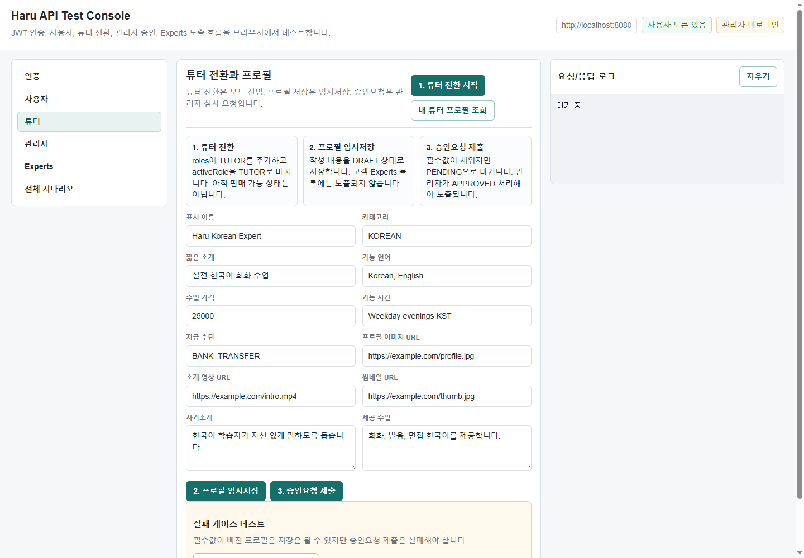
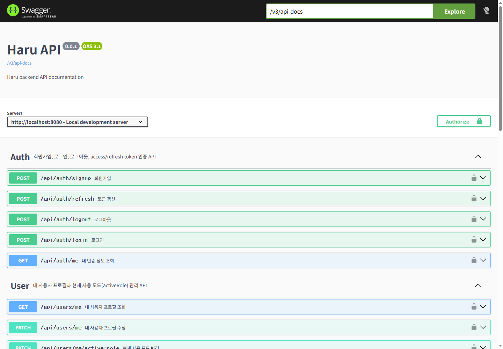

# Haru Backend

Java Spring Boot 기반 Haru 백엔드 API 서버입니다.

현재 구현 범위는 JWT 인증, 사용자 프로필, 튜터 전환, 튜터 프로필 승인 흐름, Experts 공개 목록 조회입니다.

## Current Status

현재까지 구현 및 검증된 범위입니다.

- JWT 기반 회원가입, 로그인, 로그아웃, refresh token 회전
- refresh token 재사용 차단
- 마지막 로그인 시각 기록
- 사용자 프로필 조회 및 수정
- `roles`, `activeRole`, `tutorProfileStatus` 분리
- 튜터 전환 시 `TUTOR` role 부여 및 `activeRole = TUTOR` 전환
- 튜터 프로필 DRAFT/PENDING/APPROVED/REJECTED 상태 흐름
- 관리자 승인 전 Experts 목록 미노출
- 관리자 승인 후 Experts 목록 노출
- 승인된 튜터 프로필 수정 시 DRAFT 복귀 및 재승인 요구
- Swagger API 설명 추가
- 브라우저 API Test Console 추가

## Verification

마지막 검증 결과:

```text
.\gradlew.bat build
BUILD SUCCESSFUL
```

검증한 주요 시나리오:

- 회원가입, 로그인, 로그아웃
- access token 인증
- refresh token 회전 및 재사용 차단
- 사용자 프로필 수정
- 튜터 전환, 프로필 임시저장, 승인요청 제출
- 관리자 승인/반려
- 승인 전 Experts 미노출
- 승인 후 Experts 노출
- 잘못된 요청, 인증 없음, 권한 없음, 없는 리소스 처리

## Screenshots

API Test Console:



Swagger UI:



## Tech Stack

- Java 21
- Spring Boot 3.5.7
- Spring Security
- Spring Data JPA
- Flyway
- MySQL 8.x
- Gradle
- springdoc-openapi Swagger UI

## Local Requirements

- JDK 21
- Docker 또는 로컬 MySQL
- MySQL 8.x

기본 로컬 DB 설정은 다음과 같습니다.

```yaml
spring.datasource.url: jdbc:mysql://localhost:3306/haru
spring.datasource.username: haru
spring.datasource.password: haru
```

Docker로 MySQL을 실행하는 예시:

```powershell
docker run --name haru-mysql `
  -e MYSQL_DATABASE=haru `
  -e MYSQL_USER=haru `
  -e MYSQL_PASSWORD=haru `
  -e MYSQL_ROOT_PASSWORD=root `
  -p 3306:3306 `
  -d mysql:8.4
```

## Run

```powershell
.\gradlew.bat bootRun
```

서버 기본 포트:

```text
http://localhost:8080
```

Swagger UI:

```text
http://localhost:8080/swagger-ui.html
```

API Test Console:

```text
http://localhost:8080/test-ui.html
```

브라우저에서 회원가입, 로그인, refresh, 사용자 프로필 수정, 튜터 전환, 튜터 프로필 제출, 관리자 승인/반려, Experts 노출 여부를 직접 테스트할 수 있습니다.

OpenAPI JSON:

```text
http://localhost:8080/v3/api-docs
```

## Test

```powershell
.\gradlew.bat test
```

전체 빌드:

```powershell
.\gradlew.bat build
```

현재 통합 테스트는 다음 흐름을 검증합니다.

- 회원가입, 로그인, 로그아웃
- access token 인증
- refresh token 회전 및 재사용 차단
- 사용자 프로필 조회/수정
- activeRole 변경
- 튜터 전환
- 튜터 프로필 작성, 제출, 승인, 반려
- 승인 전 Experts 미노출
- 승인 후 Experts 노출
- 승인된 프로필 수정 시 DRAFT 복귀 및 Experts 노출 중단
- 잘못된 요청, 권한 없음, 인증 없음, 없는 리소스 처리

## Database Migration

Flyway를 사용해 DB 스키마를 버전 관리합니다.

마이그레이션 파일 위치:

```text
src/main/resources/db/migration
```

현재 주요 마이그레이션:

- `V1__auth_user_schema.sql`: 사용자, 권한, refresh token 기본 스키마
- `V2__add_user_last_login_at.sql`: 마지막 로그인 시각 추가
- `V3__create_tutor_profiles.sql`: 튜터 프로필 및 승인 상태 추가

Hibernate `ddl-auto`는 `validate`로 설정되어 있습니다. 테이블/컬럼 변경은 Entity 수정만으로 끝내지 않고 Flyway 마이그레이션을 추가해야 합니다.

## Auth and User Model

사용자는 하나의 계정으로 학생 모드와 튜터 모드를 모두 사용할 수 있습니다.

구분 기준:

- `user_roles`: 계정이 사용할 수 있는 권한/모드 목록
- `users.active_role`: 현재 사용자가 선택한 앱 모드
- `tutor_profiles.status`: 튜터 프로필 심사 및 Experts 노출 상태

중요한 규칙:

```text
activeRole = TUTOR
```

는 튜터 모드 진입을 의미합니다.

```text
tutorProfileStatus = APPROVED
```

일 때만 고객 메인 Experts 목록에 노출됩니다.

## Main APIs

Auth:

- `POST /api/auth/signup`
- `POST /api/auth/login`
- `POST /api/auth/refresh`
- `POST /api/auth/logout`
- `GET /api/auth/me`

User:

- `GET /api/users/me`
- `PATCH /api/users/me`
- `PATCH /api/users/me/active-role`

Tutor:

- `POST /api/tutors/me/switch`
- `GET /api/tutors/me/profile`
- `PUT /api/tutors/me/profile`
- `POST /api/tutors/me/profile/submit`
- `GET /api/tutors`

Admin:

- `PATCH /api/admin/tutors/{tutorProfileId}/approve`
- `PATCH /api/admin/tutors/{tutorProfileId}/reject`

## Documentation

상세 문서:

- `docs/POSTMAN_API_TEST_GUIDE.md`: Postman 테스트 가이드
- `docs/TUTOR_ROLE_AND_PROFILE_FLOW.md`: 튜터 전환, activeRole, tutorProfileStatus 흐름
- `docs/DATABASE_SCHEMA.md`: DB 테이블, 컬럼, 제약조건, 관계 정리
- `docs/PROJECT_OVERVIEW.md`: 프로젝트 개요
- `docs/BACKEND_ARCHITECTURE_PLAN.md`: 백엔드 구조 계획
- `docs/API_PLANNING.md`: API 계획
- `docs/IMPLEMENTATION_ROADMAP.md`: 구현 로드맵

## Notes

- `/api/tutors`는 공개 API입니다.
- `/api/admin/**`는 `ROLE_ADMIN` 권한이 필요합니다.
- refresh token은 회전 방식입니다. 한 번 사용한 refresh token은 재사용할 수 없습니다.
- 승인된 튜터 프로필을 수정하면 `DRAFT`로 돌아가며, 재제출 및 재승인이 필요합니다.
