<div align="center">



# Haru Backend

JWT 인증, 사용자 계정, 튜터 전환, 튜터 프로필 승인 흐름을 제공하는 Spring Boot 기반 API 서버입니다.

`Spring Boot 3.5` · `Java 21` · `MySQL 8` · `Flyway` · `Docker Compose`

<br>


</div>

---

## Overview

Haru 백엔드는 하나의 사용자 계정으로 학생 모드와 튜터 모드를 함께 사용할 수 있도록 설계된 API 서버입니다.  
튜터 전환은 즉시 판매 가능한 강사가 되는 절차가 아니며, 튜터 프로필 작성과 관리자 승인을 거쳐야 고객 메인 Experts 목록에 노출됩니다.

현재 저장소에는 다음 산출물이 포함되어 있습니다.

| Area | Description |
| --- | --- |
| Backend API | 인증, 사용자, 튜터, 관리자 API |
| Test Console | 브라우저에서 전체 API 시나리오를 실행하는 테스트 프론트 |
| API Docs | Swagger UI 및 OpenAPI JSON |
| Database | Flyway 기반 MySQL 스키마 및 local seed |
| Docker | backend + MySQL 통합 실행 환경 |

## Current Status

| Category | Status |
| --- | --- |
| Auth | 회원가입, 로그인, 로그아웃, refresh token 회전 및 재사용 차단 |
| User | 프로필 조회/수정, 마지막 로그인 시각 기록, activeRole 변경 |
| Tutor | 튜터 전환, 프로필 임시저장, 승인요청, 상태 관리 |
| Schedule | 튜터 가능 시간 슬롯 저장/조회 |
| Booking | 25분 수업 예약 생성, 내 예약 조회, 취소, 입장 가능 여부 |
| Admin | 튜터 프로필 승인/반려 |
| Experts | 승인된 튜터만 공개 목록에 노출 |
| Docs | Swagger, API 계획, DB 문서, README |
| Runtime | Docker Compose로 backend + MySQL 실행 |

## Screenshots

### API Test Console


### Swagger UI


## Quick Start

Docker Compose로 백엔드, 테스트 프론트, MySQL을 한 번에 실행합니다.

```powershell
docker compose up --build -d
```

실행 후 아래 주소로 접속합니다.

| Service | URL |
| --- | --- |
| Backend API | http://localhost:8080 |
| API Test Console | http://localhost:8080/test-ui.html |
| Swagger UI | http://localhost:8080/swagger-ui.html |
| OpenAPI JSON | http://localhost:8080/v3/api-docs |
| MySQL | localhost:3306 |

컨테이너 상태 확인:

```powershell
docker compose ps
```

백엔드 로그 확인:

```powershell
docker compose logs -f backend
```

컨테이너 중지:

```powershell
docker compose down
```

DB 데이터까지 초기화:

```powershell
docker compose down -v
```

## Accounts

Docker Compose 실행 시 Flyway local seed가 테스트용 관리자 계정을 생성합니다.

### Service Account

| Type | Value |
| --- | --- |
| Email | `admin@admin.com` |
| Password | `admin1234` |
| Role | `ADMIN`, `STUDENT` |

### MySQL Account

| Type | Value |
| --- | --- |
| Host | `localhost` |
| Port | `3306` |
| Database | `haru` |
| Username | `haru` |
| Password | `1q2w3e4r!` |

## Tech Stack

| Layer | Technology |
| --- | --- |
| Language | Java 21 |
| Framework | Spring Boot 3.5.7 |
| Security | Spring Security, JWT |
| Database | MySQL 8.x |
| Persistence | Spring Data JPA, Hibernate |
| Migration | Flyway |
| API Docs | springdoc-openapi |
| Build | Gradle |
| Runtime | Docker Compose |

## Local Development

Docker를 사용하지 않고 로컬에서 실행하려면 JDK 21과 MySQL 8.x가 필요합니다.

기본 DB 설정:

```yaml
spring.datasource.url: jdbc:mysql://localhost:3306/haru
spring.datasource.username: haru
spring.datasource.password: haru
```

애플리케이션 실행:

```powershell
.\gradlew.bat bootRun
```

로컬 관리자 seed까지 적용하려면 `local` 프로필을 사용합니다.

```powershell
$env:SPRING_PROFILES_ACTIVE='local'
.\gradlew.bat bootRun
```

## Build And Test

전체 빌드:

```powershell
.\gradlew.bat build
```

테스트만 실행:

```powershell
.\gradlew.bat test
```

최근 검증 결과:

```text
BUILD SUCCESSFUL
```

Docker 환경에서 확인한 항목:

| Check | Result |
| --- | --- |
| `docker compose up --build -d` | Passed |
| backend container on `8080` | Passed |
| mysql container on `3306` | Passed |
| MySQL healthcheck | Passed |
| Flyway migration | Passed |
| Local admin seed | Passed |
| `/test-ui.html` | HTTP 200 |
| `/v3/api-docs` | HTTP 200 |
| Admin login | Passed |

## Domain Model

사용자는 하나의 계정으로 학생 모드와 튜터 모드를 모두 사용할 수 있습니다.

| Field | Meaning |
| --- | --- |
| `user_roles` | 계정에 부여된 사용 가능 역할 목록 |
| `users.active_role` | 현재 사용자가 선택한 앱 모드 |
| `tutor_profiles.status` | 튜터 프로필 심사 및 Experts 노출 상태 |

핵심 규칙:

```text
activeRole = TUTOR
```

튜터 모드에 진입했다는 뜻입니다. 고객에게 판매 가능한 튜터라는 뜻은 아닙니다.

```text
tutorProfileStatus = APPROVED
```

이 상태일 때만 고객 메인 Experts 목록에 노출됩니다.

튜터 프로필 상태:

| Status | Meaning |
| --- | --- |
| `DRAFT` | 작성 중 |
| `PENDING` | 승인 대기 |
| `APPROVED` | 승인 완료 |
| `REJECTED` | 반려 |

## Database

DB 스키마는 Flyway로 관리합니다.

```text
src/main/resources/db/migration
src/main/resources/db/seed/local
```

주요 테이블:

| Table | Description |
| --- | --- |
| `users` | 사용자 계정 |
| `user_roles` | 사용자 역할 목록 |
| `refresh_tokens` | refresh token 저장 및 회전 관리 |
| `tutor_profiles` | 튜터 프로필 및 승인 상태 |
| `tutor_schedule_slots` | 튜터 가능 시간 슬롯 |
| `bookings` | 학생-튜터 수업 예약 |
| `flyway_schema_history` | Flyway migration 이력 |

현재 마이그레이션:

| File | Description |
| --- | --- |
| `V1__auth_user_schema.sql` | 사용자, 역할, refresh token 기본 스키마 |
| `V2__add_user_last_login_at.sql` | 마지막 로그인 시각 컬럼 추가 |
| `V3__create_tutor_profiles.sql` | 튜터 프로필 및 승인 상태 추가 |
| `V4__structure_tutor_profile_pricing.sql` | 25분/50분 튜터 가격 컬럼 추가 |
| `V5__drop_legacy_tutor_lesson_price_amount.sql` | legacy 단일 가격 컬럼 제거 |
| `V6__create_tutor_schedule_slots.sql` | 튜터 가능 시간 슬롯 추가 |
| `V7__create_bookings.sql` | 25분 수업 예약 테이블 추가 |
| `R__local_admin_seed.sql` | 로컬 개발용 관리자 계정 seed |

Hibernate `ddl-auto`는 `validate`로 설정되어 있습니다.  
테이블이나 컬럼 변경은 Entity 수정만으로 처리하지 않고 Flyway 마이그레이션을 추가해야 합니다.

## API Summary

### Auth

| Method | Path | Description |
| --- | --- | --- |
| `POST` | `/api/auth/signup` | 회원가입 |
| `POST` | `/api/auth/login` | 로그인 |
| `POST` | `/api/auth/refresh` | access token 재발급 |
| `POST` | `/api/auth/logout` | 로그아웃 |
| `GET` | `/api/auth/me` | 현재 로그인 사용자 조회 |

### User

| Method | Path | Description |
| --- | --- | --- |
| `GET` | `/api/users/me` | 내 사용자 정보 조회 |
| `PATCH` | `/api/users/me` | 내 사용자 정보 수정 |
| `PATCH` | `/api/users/me/active-role` | 현재 앱 모드 변경 |

### Tutor

| Method | Path | Description |
| --- | --- | --- |
| `POST` | `/api/tutors/me/switch` | 튜터 모드 전환 및 DRAFT 프로필 생성 |
| `GET` | `/api/tutors/me/profile` | 내 튜터 프로필 조회 |
| `PUT` | `/api/tutors/me/profile` | 내 튜터 프로필 저장 |
| `POST` | `/api/tutors/me/profile/submit` | 튜터 프로필 승인 요청 |
| `GET` | `/api/tutors` | 승인된 Experts 목록 조회 |
| `GET` | `/api/tutors/{tutorProfileId}` | 승인된 Expert 상세 조회 |

### Schedule

| Method | Path | Description |
| --- | --- | --- |
| `PUT` | `/api/tutors/me/schedule` | 내 가능 시간 슬롯 전체 교체 |
| `GET` | `/api/tutors/me/schedule` | 내 가능 시간 슬롯 조회 |
| `GET` | `/api/tutors/{tutorProfileId}/schedule` | 승인된 튜터 가능 시간 공개 조회 |

### Booking

| Method | Path | Description |
| --- | --- | --- |
| `POST` | `/api/bookings` | 25분 수업 예약 생성 |
| `GET` | `/api/bookings/me` | 내 예약 목록 조회 |
| `GET` | `/api/bookings/{bookingId}` | 예약 상세 조회 |
| `PATCH` | `/api/bookings/{bookingId}/cancel` | 예약 취소 |
| `GET` | `/api/bookings/{bookingId}/join` | 수업 입장 가능 여부 조회 |

### Admin

| Method | Path | Description |
| --- | --- | --- |
| `PATCH` | `/api/admin/tutors/{tutorProfileId}/approve` | 튜터 프로필 승인 |
| `PATCH` | `/api/admin/tutors/{tutorProfileId}/reject` | 튜터 프로필 반려 |
| `GET` | `/api/admin/tutors/pending` | 튜터 승인 대기 목록 조회 |

상세 요청/응답은 Swagger UI와 API 계획 문서를 기준으로 확인합니다.

## Project Structure

```text
src/main/java/com/haru
├── auth
├── booking
├── common
├── schedule
├── tutor
└── user

src/main/resources
├── db/migration
├── db/seed/local
└── static/test-ui.html

docs
├── DATABASE_SCHEMA.md
├── API_PLANNING.md
└── TUTOR_ROLE_AND_PROFILE_FLOW.md
```

## Documentation

| Document | Description |
| --- | --- |
| [DB 테이블 구조](docs/DATABASE_SCHEMA.md) | 테이블, 컬럼, 제약조건, 관계 |
| [API 계획](docs/API_PLANNING.md) | 현재 구현 API와 이후 구현 후보 |
| [튜터 전환 및 activeRole 흐름](docs/TUTOR_ROLE_AND_PROFILE_FLOW.md) | 튜터 모드와 승인 상태 구분 |
| [기획안 대비 구현 현황](docs/IMPLEMENTATION_STATUS_VS_PPT.md) | PPT 기획안 기준 구현/미구현 현황 |
| [프로젝트 개요](docs/PROJECT_OVERVIEW.md) | 프로젝트 방향성 |
| [백엔드 아키텍처 계획](docs/BACKEND_ARCHITECTURE_PLAN.md) | 백엔드 구조 계획 |
| [구현 로드맵](docs/IMPLEMENTATION_ROADMAP.md) | 구현 단계 |

## Operational Notes

- `/api/tutors`, `/api/tutors/{tutorProfileId}`, `/api/tutors/{tutorProfileId}/schedule`은 승인된 튜터만 반환하는 공개 API입니다.
- `/api/admin/**`는 `ADMIN` 권한이 필요합니다.
- refresh token은 회전 방식입니다. 한 번 사용된 refresh token은 재사용할 수 없습니다.
- 승인된 튜터 프로필을 수정하면 상태가 `DRAFT`로 돌아가며, 다시 승인 요청과 관리자 승인이 필요합니다.
- Docker Compose DB 비밀번호는 로컬 개발용입니다. 운영 환경에서는 반드시 별도 secret으로 교체해야 합니다.
